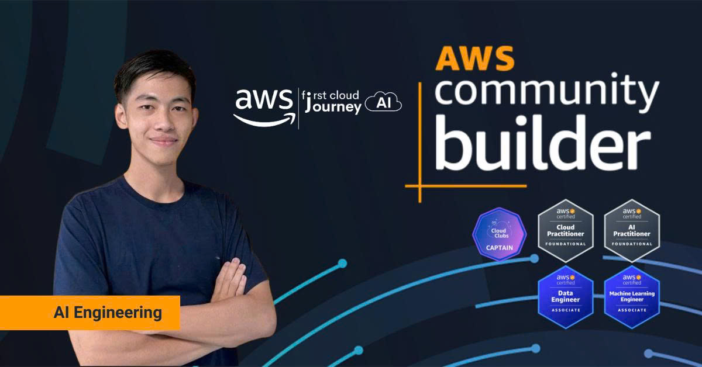

  

  

📍 **Ho Chi Minh City, Vietnam** | 🤖 **Gen AI Engineer** | ☁️ **AWS Community Builder** | 🎓 **AWS Cloud Club Captain @ HUFLIT**

> Building AI-powered solutions that drive measurable business impact. From enterprise chatbots to voice agents deployed on AWS Cloud.

  
  
  
  
  

---

## Current Projects

### 🤖 AI & Voice Agents

- 🎙️ **[scalable-real-time-voice-agent-amazon-eks-bedrock-claude](https://github.com/ihatesea69/scalable-real-time-voice-agent-amazon-eks-bedrock-claude)** - Scalable real-time AI voice agent on AWS EKS with Bedrock Claude, WebRTC, AWS Transcribe, Piper TTS, Langfuse
- 🎙️ **[realtime-voice-assistant-openai](https://github.com/ihatesea69/realtime-voice-assistant-openai)** - Real-time AI voice agent with Pipecat, OpenAI Whisper STT, GPT-4, Vietnamese support
- 📊 **[Monitoring-Voice-Agent-with-LangSmith-Build-on-AWS](https://github.com/ihatesea69/Monitoring-Voice-Agent-with-LangSmith-Build-on-AWS)** - Voice Agent with Pipecat on AWS + LangSmith monitoring
- 💬 **[langgraph-customer-service-chatbot](https://github.com/ihatesea69/langgraph-customer-service-chatbot)** - AI customer service with LangGraph + Gemini 2.0, Vietnamese NLP, rate limiting
- 🔍 **[agentic-rag-langchain](https://github.com/ihatesea69/agentic-rag-langchain)** - Agentic RAG pipeline with LangGraph + LangChain, self-corrective document grading and question rewriting
- 📊 **[beir-retrieval-benchmark](https://github.com/ihatesea69/beir-retrieval-benchmark)** - Benchmarking BM25 vs RAG dense retrieval vs Hybrid (RRF) on BeIR datasets with LlamaIndex + pgvector
- 🤖 **[aws-instructor-agent](https://github.com/ihatesea69/aws-instructor-agent)** - AI Agent for automating AWS workshop tutorial creation using browser-use and LangGraph

### 🛠️ MCP Servers & Developer Tools

- ☁️ **[aws-mcp-server](https://github.com/ihatesea69/aws-mcp-server)** - Control AWS infrastructure with natural language via Claude Desktop
- 📊 **[office-powerpoint-mcp-server](https://github.com/ihatesea69/office-powerpoint-mcp-server)** - Enterprise PowerPoint automation MCP for AI assistants
- 📝 **[Office-Word-MCP](https://github.com/ihatesea69/Office-Word-MCP)** - Word document automation MCP for Amazon Q & Kiro
- 🔧 **[odoo-18-cli-toolkit](https://github.com/ihatesea69/odoo-18-cli-toolkit)** - CLI toolkit for Odoo 18 with AI-powered PostgreSQL queries
- 📄 **[nghilatex](https://github.com/ihatesea69/nghilatex)** - Modern AI-powered LaTeX workspace with real-time preview and intelligent document assistance
- 📚 **[latex-to-code-ai-tutorial](https://github.com/ihatesea69/latex-to-code-ai-tutorial)** - LaTeX Tutorial: Generate Professional Documents with AI Assistants (MiKTeX, VS Code, Cursor)
- 🧠 **[HieuNghi-AI-Skills](https://github.com/ihatesea69/HieuNghi-AI-Skills)** - 101 curated Agent Skills for Claude Code, GitHub Copilot, Cursor, and Gemini CLI

### 👁️ Computer Vision & ML

- 🤖 **[Robot_Spring_2025_NguyenHueStreet](https://github.com/ihatesea69/Robot_Spring_2025_NguyenHueStreet)** - CV human detection robot at Nguyen Hue Flower Street, Tet 2025 ([News](https://thanhnien.vn/robot-ban-tim-chup-anh-cho-khach-tren-duong-hoa-nguyen-hue-185250129133644434.htm))
- 🏥 **[TransUNet-Medical-Image-Segmentation](https://github.com/ihatesea69/TransUNet-Medical-Image-Segmentation)** - PyTorch reproduction of TransUNet for medical image segmentation, Dice score 77.29% on Synapse dataset
- 🏥 **[TransUNet-Pancreas-Segmentation](https://github.com/ihatesea69/TransUNet-Pancreas-Segmentation)** - Automated pancreas segmentation from CT scans using Transformer + U-Net
- 🤟 **[Sign-Language-Recognition](https://github.com/ihatesea69/Sign-Language-Recognition)** - Deep learning sign language detection for accessibility
- 👋 **[HumanWaveDetector](https://github.com/ihatesea69/HumanWaveDetector)** - TensorFlow human detection for robotics applications
- 📸 **[iot-face-recognition-serverless](https://github.com/ihatesea69/iot-face-recognition-serverless)** - Serverless IoT face recognition with Lambda + Rekognition

### ☁️ AWS Infrastructure & DevOps

- 🚀 **[langfuse-eks-production](https://github.com/ihatesea69/langfuse-eks-production)** - Production-grade Langfuse v3 on AWS EKS Fargate with Aurora PostgreSQL + ElastiCache Redis + ClickHouse (Terraform IaC)
- 🖥️ **[phone-vibe-coding-windows](https://github.com/ihatesea69/phone-vibe-coding-windows)** - Instant Cloud Windows Dev Environment for Vibe Coding, Terraform managed
- 🔒 **[aws-msk-chatbot-security-monitor](https://github.com/ihatesea69/aws-msk-chatbot-security-monitor)** - Real-time security monitoring pipeline for chatbot apps with Kafka + Bedrock
- 🏷️ **[aws-resource-auto-tagging](https://github.com/ihatesea69/aws-resource-auto-tagging)** - Automatically tag every new AWS resource with owner/environment/project metadata via CloudTrail + EventBridge + Lambda
- 🚀 **[odoo-community-aws-deployment](https://github.com/ihatesea69/odoo-community-aws-deployment)** - Production-ready Odoo 18 deployment on AWS EC2 with CloudFormation
- 🧪 **[Innovation_Lab_Workshop](https://github.com/ihatesea69/Innovation_Lab_Workshop)** - AWS Innovation Sandbox workshop with multi-account management
- 🗣️ **[Building-a-Serverless-Text-to-Speech-Application-with-Amazon-Polly-AWS-Workshop-FCJ](https://github.com/ihatesea69/Building-a-Serverless-Text-to-Speech-Application-with-Amazon-Polly-AWS-Workshop-FCJ)** - Serverless Polly TTS workshop (EN/VI)
- 🌐 **[Bedrock-AgentCore-Workshop-FPT-University](https://github.com/ihatesea69/Bedrock-AgentCore-Workshop-FPT-University)** - Bedrock AgentCore browser automation workshop

### 💻 Full-Stack Applications

- 💼 **[salesforce-crm-clone](https://github.com/ihatesea69/salesforce-crm-clone)** - Full-featured Salesforce CRM clone with Next.js 16 + Tailwind + Clerk + Neon PostgreSQL
- 🌐 **[van-tai-danh-nam](https://github.com/ihatesea69/van-tai-danh-nam)** - Landing page for Van Tai Danh Nam (xe tai, xe 7 cho, tai xe rieng) at Kien Giang, Mien Tay
- 📝 **[Personal-Blogs](https://github.com/ihatesea69/Personal-Blogs)** - My Personal Blog

---

### 📚 Study Notes & Guides

- 🏗️ **[AWS-SAA-C03-Workshop-Study-Guide](https://github.com/ihatesea69/AWS-SAA-C03-Workshop-Study-Guide)** - AWS Solutions Architect Associate (SAA-C03) comprehensive workshop with Hugo
- 📚 **[aws-saa-study-notes-and-hands-on-labs](https://github.com/ihatesea69/aws-saa-study-notes-and-hands-on-labs)** - AWS Solutions Architect Associate (SAA-C03) study notes
- 🤖 **[aws-mla-study-notes-and-hands-on-labs](https://github.com/ihatesea69/aws-mla-study-notes-and-hands-on-labs)** - AWS Machine Learning Engineer Associate (MLA-C01)
- 📊 **[aws-dea-study-notes-and-hands-on-labs](https://github.com/ihatesea69/aws-dea-study-notes-and-hands-on-labs)** - AWS Data Engineer Associate (DEA-C01)
- 🧠 **[aws-aip-c01-exam-guide](https://github.com/ihatesea69/aws-aip-c01-exam-guide)** - AWS Certified Generative AI Developer (AIP-C01) bilingual study guide with hands-on labs
- 🎓 **[aws-dva-c02-study-plan](https://github.com/ihatesea69/aws-dva-c02-study-plan)** - AWS Certified Developer Associate (DVA-C02) comprehensive study guide built with Hugo
- 💻 **[CSharp-Study-Notes](https://github.com/ihatesea69/CSharp-Study-Notes)** - 30-chapter Vietnamese C# learning resource
- 🎨 **[aws-cloud-clubs-workshop-template](https://github.com/ihatesea69/aws-cloud-clubs-workshop-template)** - AWS Cloud Clubs workshop template
- 📦 **[Github-Template](https://github.com/ihatesea69/Github-Template)** - GitHub project template for scaffolding projects

---

## Recognition

**Finalist** — VPBank Technology Hackathon 2025 (AI Voice Agent) | **Top 20** — Olympiad of AI, Ho Chi Minh City 2025 | **Third Place** — ROBOG 2024

### AWS Certifications

  
  
  
  

---

## Community

**Founder** — AI AWS Cloud Club HUFLIT (1,000+ members) | **Speaker** — AWS Community Day 2024, FCAJ University Events

---

  

